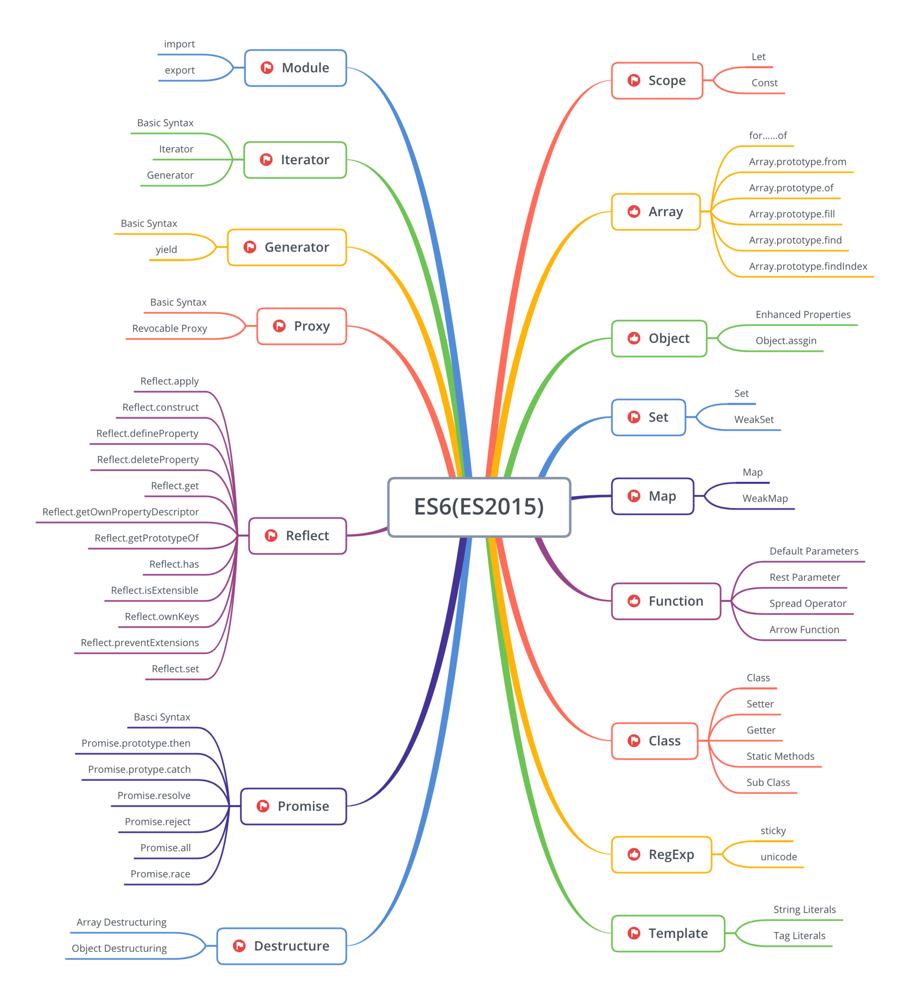
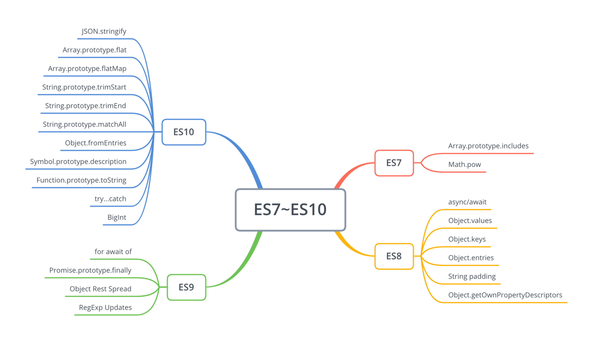
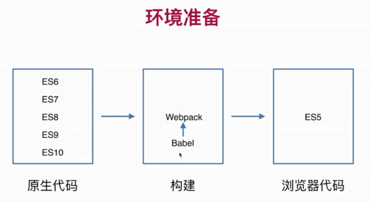
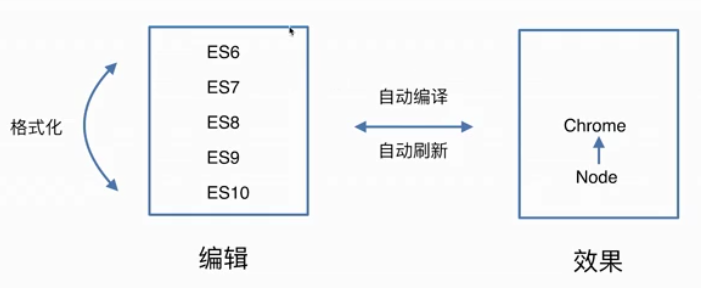

# 再学JavaScript ES(6-10)全版本语法大全

`Vue.js React node` -> JS(ECMAScript)

全新JavaScript体系ES6(ES2015):`Module、Scope、Array lterator、Object、Generator、Set、Proxy、Map、Function、Reflect、Class、Promise、RegExp、Destructure、Template`


全新JavaScript体系 ES7~ES10:
ES7 `Array.prototype.includes、Math.pow`

ES8 `async/await、Object.values、Object.keys、object.entries、String padding、Object.getOwnProperty Descriptors`

ES9  `for await of、Promise.prototype.finally、Object Rest Spread、RegExp Updates`

ES10  `JSON、Array、String、object、Symbol、Function、BigInt`


```javascript
示例1：将嵌套的数组实现扁平化输出
**原生能力支持无须单独实现**
//ES5实现方式
function flatten (arr) {
return !Array.isArray(arr) ? arr:[].concat.apply([],arr.map(flatten))}
flatten([1,[2,3],4,[[5,6],7]])
//ES6+实现方式
[1,[2,3],4,[[5,6],7].flat(3)]

示例2：将复杂问题简单化
如何给已知的数组去重
//ES5实现方式
function unique(array){
    var obj={}
    return array.filter(function (item,index,array){
        return obj.hasOwnProperty(item)? false:(obj[item]=true)
    })
}
unique([1,2,3,4,3])
//ES6+实现方式
Array.from(new Set([1,2,3,4,3]))

示例3：动态渲染一个DOM片段
降低代码维护成本
//ES5实现方式
var list = [{name: "小丽",age: 20}, {name: "小明",age: 22}]
function makeString(data) {
    var tplArr = ['<table><td>name</td><td>age</td>']
    for (var i = 0; i < data.length; i++) {
        tplArr.push('<tr><td>' + data[i].name + '</td><td>' + data[i].age + '</td></tr>')
    }
    tplArr.push('</table>')
    return tplArr.join('')
}
document.write(makeString(list));
console.log(makeString(list));
//ES6+实现方式
const list=[{name:"小丽",age:20},{name:"小明",age:22}]
function makeString (data){
    let body=''
    for(let item of data){
        body +=`<tr><td>${item.name}</td><td>${item.age}</td></tr>`
    }
    return `
        <table>
            <td>name</td><td>age</td>
            ${body}
        </table>
        `
}
document.write(makeString(list));
console.log(makeString(list));

示例4：请用一步操作
在"this cost is $100,not $1000 and $20 and ￥100"
字符串中精确找出前面字符是$且小于四位数的金额
让无能为力变得轻而易举
//ES5实现方式   无解
//ES6+实现方式
'this cost is $100,not $1000 and $20 and ￥100'.match(/(?<=\$)\d{1,3}(?!\d)/g)
```


环境->语法->阅读->练习->Vue->构建



## Let & Const作用域基础语法

全局、块级、函数、动态作用域

```javascript
JavaScript 变量生命周期在它声明时初始化
局部变量在函数执行完毕后销毁
全局变量在页面关闭后销毁
var a=1//用var定义是全局变量（不可删除）
b=2//不用var定义(无论函数内外)都是window(全局对象)的属性（可删除）
delete a //false
delete b //true

function f1(){
    c=3//全局作用域
    if (c===3){
        var d=4//存在变量提升，会在上层var d,在此处d=4;故引入let
    }else{
        console.log(c)
    }
    console.log(d)
    return d+1//return向外传递
}
f1()
delete c //true 不用var定义(无论函数内外)都是window(全局对象)的属性（可删除）

function f2(){
    var a = 3
    function f3(){
        var b = 4
        return a+b
    }
    return f3()//闭包向外传递
}
f2()//f3()向上层找a的值，返回7

window.e=5
function f3(){
    console.log(this.e)//this是动态指向，不是固定指向window
}
f3()
f3.bind({e:100})()//函数动态绑定，动态作用域
```

## let和const区别

let `let具有块级作用域`+`let声明的全局变量不是全局对象的属性,不能用全局作用域window访问`+`不能重复定义变量`+`不会进行变量提升`

const `const只能定义常量`+`必须在声明时进行初始化`

扩展阅读：

1.什么是作用域

2.JavaScript深入之词法作用域和动态作用域

3.深入理解JS中声明提升、作用域（链）和this 关键字

for(var i=0;i<3;i++){
    setTimeout(function(){
        console.log(i);
    },1000);
}

同步优先于异步优先于回调

### 2-6Array遍历、转换、生成、查找

```node
ES5中数组遍历有多少种方法？他们有什么优势和缺点？
`lesson2-2.js`
// for循环
// forEach  ES5新增API  不支持continue和break
// every  ES5新增API  默认返回false，不进行下一次遍历
// for in 为 `object`设计，数组是对象，数组可遍历

// for of ES6新增 允许自定义数据结构 ->可遍历

ES5中将伪数组转换成数组该怎么办?ES6中如何做呢？
`集合调用不了数组的API` -> 可转换
// 伪数组2特征：按索引方式存储数据、具length属性
初始化并都赋值为1长度为5的数组实践
// for循环 ->
// Array.from(arrayLike 伪数组,mapFn map函数,thisArg 接收参数)
// let array = Array.from({ length: 5 }, function () { return 1 })  ->
// let array = Array(5).fill(1)

ES5中创建一个新数组该怎么做？ES6中如何做呢？
ES5生成新数组:
let array = Array(5)
let array = []
Array.push(1)
ES6:
// Array.fill(value,start,end)    start、end默认为第一个和最后一个
let array = [1, 2, 3, 4, 5]
console.log(array.fill(8, 2, 4))  //1，2，8，8，5

ES5中如何查找一个元素呢？ES6中如何做呢？
// ES5查找
let find = array.filter(function (item) {
  return item % 2 === 0   //所有元素为偶数
})
console.log(find)         filter返回数组，缺陷：数组长度大，想查询是否有某元素，低效（会遍历所有）
// ES6查找   Array.prototype.find
let find = array.find(function (item) {
  return item % 2 === 0
})
console.log(find)  //find返回满足条件第一个值，不再继续寻找
let findIndex = array.findIndex(function (item) {
  return item % 2 === 0
})
console.log(findIndex)  //返回值的索引
练习1.JavaScript世界里有哪些元素是可遍历的？
    2.如何给数据结构自定义遍历？
    3.find()和ES5的filter（）有什么区别？
2-11
```
